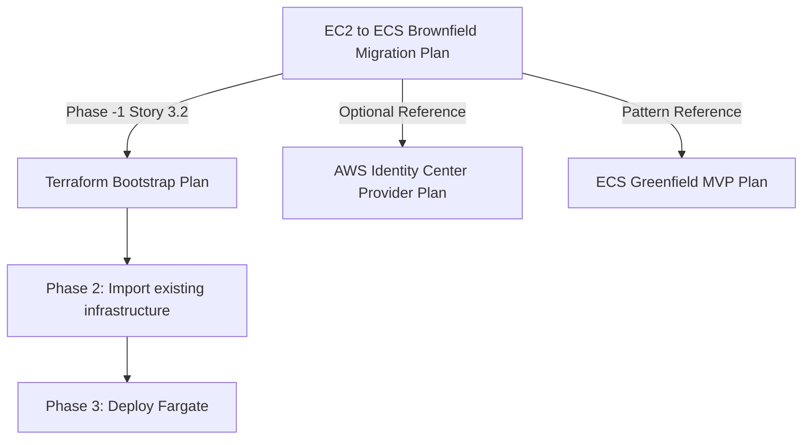

# EC2 to ECS Fargate Brownfield Migration Plan

## Overview

This is a **comprehensive, phase-by-phase migration plan** for moving existing EC2-based applications to AWS ECS Fargate in a brownfield (existing production) environment. This plan orchestrates multiple specialized sub-plans to guide teams through a safe, zero-downtime migration.

**Plan Type:** Meta-plan (Plan of Plans)  
**Audience:** DevOps teams, platform engineers, technical leads  
**Scope:** Complete brownfield migration from EC2 to containerized Fargate workloads

---

## Plan Architecture

This migration plan **references and coordinates** specialized plans for different aspects of the migration:

### 📋 Referenced Plans

1. **[Terraform Bootstrap Plan](../terraform-bootstrap-plan/README.md)**
   - Covered in: Phase -1, Story 3.2
   - Sets up Terraform state backend (S3 + DynamoDB)
   - Enables team collaboration on infrastructure code
   - **Complete this before starting Phase 2**

2. **[Prepare App for 12-Factor Plan](../prepare-app-for-12-factor-plan/README.md)** ⭐ **PREREQUISITE**
   - **Must complete before containerization**
   - Externalizes configuration and secrets
   - Eliminates ephemeral filesystem dependencies
   - Implements stdout logging and health checks
   - Migrates sessions to Redis/database
   - Replaces cron with EventBridge
   - Configures proxy headers and connection pooling
   - **Team:** Development team
   - **Duration:** 2-4 weeks
   - **Can be validated on EC2 before Docker**

3. **[Containerizing Services Plan](../containerizing-services-plan/README.md)** ⭐ **PREREQUISITE**
   - **Must complete after 12-Factor preparation**
   - Creates production-ready Dockerfiles
   - Implements PID 1 handling and graceful shutdown
   - Optimizes container startup and resource usage
   - Implements container security (non-root, scanning)
   - **Team:** DevOps/Platform team
   - **Duration:** 1-2 weeks
   - **Validates Docker best practices**

4. **[AWS Identity Center Provider Migration Plan](../aws-identity-center-provider-migration-plan/README.md)** _(if applicable)_
   - Authentication provider consolidation
   - SSO migration strategies
   - Identity federation patterns

5. **[ECS Greenfield MVP Plan](../ecs-greenfield-mvp-plan/README.md)** _(reference for new patterns)_
   - Modern ECS patterns for comparison
   - Greenfield best practices
   - Future-state architecture examples

---

## Migration Phases

This plan follows a phased approach with clear dependencies and checkpoints:

### Phase -1: [Prerequisites & Local Setup](plan/phase-0-prerequisites.md)

- **Duration:** 1-2 days
- **Deliverables:** AWS access, tools installed, repository structure
- **References:** [Terraform Bootstrap Plan](../terraform-bootstrap-plan/README.md) for state backend

### Phase 0: [Discovery](plan/phase-1-discovery.md)

- **Duration:** 3-5 days
- **Deliverables:** Infrastructure inventory, migration blockers identified
- **Checkpoint:** Discovery review meeting

### Phase 1: Application Readiness ⭐ **NOW TWO SEPARATE PLANS**

**This phase has been split into two specialized plans for better team ownership:**

#### Phase 1a: [Prepare App for 12-Factor Plan](../prepare-app-for-12-factor-plan/README.md)

- **Duration:** 2-4 weeks
- **Team:** Development team
- **Deliverables:**
  - Configuration externalized to environment variables
  - Sessions stored in Redis/database
  - Logs output to stdout
  - Health check endpoints implemented
  - File storage migrated to S3
  - Cron jobs migrated to EventBridge
  - Background workers separated
  - Proxy headers configured
  - Database connection pooling implemented
- **Checkpoint:** All changes validated on EC2 **before** containerization
- **Key Benefit:** Can test 12-Factor patterns on existing EC2 infrastructure

#### Phase 1b: [Containerizing Services Plan](../containerizing-services-plan/README.md)

- **Duration:** 1-2 weeks
- **Team:** DevOps/Platform team
- **Prerequisites:** Phase 1a complete and validated on EC2
- **Deliverables:**
  - Production-ready Dockerfiles
  - PID 1 handling (tini) configured
  - Graceful shutdown (SIGTERM) implemented
  - Multi-architecture images (ARM64 + x86_64)
  - Container startup optimized
  - Security hardening (non-root user, image scanning)
  - docker-compose for local development
- **Checkpoint:** Containers tested locally and pass all security scans

### Phase 2: [Infrastructure Setup](plan/phase-3-infrastructure-setup.md)

- **Duration:** 1-2 weeks
- **Deliverables:** Imported existing infra, new Fargate infrastructure provisioned
- **Checkpoint:** Infrastructure validated, zero production impact
- **Key Story:** Import existing infrastructure to Terraform (brownfield-specific)

### Phase 3: [Initial Deployment](plan/phase-4-initial-deployment.md)

- **Duration:** 1 week
- **Deliverables:** First application running on Fargate
- **Checkpoint:** First service deployed, health checks passing

### Phase 4: [Traffic Migration](plan/phase-5-traffic-migration.md)

- **Duration:** 1-2 weeks
- **Deliverables:** Production traffic migrated
- **Checkpoint:** 100% traffic on Fargate, EC2 in standby

### Phase 5: [Scaling & Decommissioning](plan/phase-5-scaling.md)

- **Duration:** 1 week
- **Deliverables:** Auto-scaling configured, EC2 instances terminated
- **Checkpoint:** Migration complete, runbook documented

---

## Migration Timeline & Dependencies

```
Phase -1: Prerequisites (1-2 days)
    ↓
Phase 0: Discovery (3-5 days)
    ↓
Phase 1a: 12-Factor App Preparation (2-4 weeks) ← Development Team
    ↓ Validate on EC2
Phase 1b: Containerization (1-2 weeks) ← DevOps Team
    ↓ Test locally with Docker
Phase 2: Infrastructure Setup (1-2 weeks)
    ↓
Phase 3: Initial Deployment (1 week)
    ↓
Phase 4: Traffic Migration (1-2 weeks)
    ↓
Phase 5: Scaling & Decommissioning (1 week)

Total Duration: 8-14 weeks
```

**Critical Path:** Phase 1a → Phase 1b → Phase 2

**Parallel Opportunities:**

- Terraform bootstrap can happen during Discovery
- Infrastructure planning can happen during Phase 1b
- Security group design can happen during Phase 1b

---

## Key Differentiators (Brownfield Focus)

This plan is specifically designed for **brownfield migrations** with existing production infrastructure:

✅ **Import existing resources** into Terraform before creating new ones  
✅ **Zero-downtime migration** with gradual traffic shifting  
✅ **Coexistence period** where EC2 and Fargate run simultaneously  
✅ **Rollback strategies** at every phase  
✅ **Production-first mindset** with extensive validation gates

**Not covered in this plan:**

- Greenfield ECS deployments (see [ECS Greenfield MVP Plan](../ecs-greenfield-mvp-plan/README.md))
- Kubernetes migrations
- Non-AWS container platforms

---

## Appendix Documents

These themed reference documents support the migration phases:

### 1. [AWS Authentication and Security](appendix/aws-authentication-and-security.md)

**Topics covered:**

- AWS CLI authentication methods (access keys, session tokens, SSO)
- GitHub Actions OIDC authentication with AWS
- IAM security best practices
- Security hardening checklist

**Use this when:**

- Setting up AWS CLI access for team members
- Configuring GitHub Actions authentication
- Choosing between access keys and SSO
- Implementing security best practices

---

### 2. [ECS Deployment Fundamentals](ecs-deployment-fundamentals.md)

**Topics covered:**

- What is a task definition?
- Complete deployment sequence
- Component relationships (ALB, target groups, services, tasks)
- Naming conventions
- Task definition versions and deployment process

**Use this when:**

- Understanding how ECS components fit together
- Creating your first ECS service
- Planning resource naming conventions
- Troubleshooting deployment issues

---

### 3. [Networking and Security Groups](networking-and-security-groups.md)

**Topics covered:**

- Security group patterns for ECS
- Baseline + service-specific security group approach
- Implementation in ECS services
- When to use each pattern
- Migration path from one-per-service

**Use this when:**

- Creating security groups for new ECS services
- Deciding between shared vs per-service security groups
- Implementing least-privilege network access
- Scaling from 1 to 10+ services

---

### 4. [GitHub Actions CI/CD](github-actions-cicd.md)

**Topics covered:**

- Secrets vs configuration values
- Reusable workflows for scale
- Common deployment patterns (single environment, multi-environment, manual approval)
- Cost optimization

**Use this when:**

- Setting up GitHub Actions for the first time
- Implementing reusable workflows
- Understanding what to store in GitHub Secrets vs workflow files
- Optimizing CI/CD costs

---

### 5. [Secrets Management](secrets-management.md)

**Topics covered:**

- EC2 vs ECS secrets handling comparison
- AWS Secrets Manager integration
- Security improvements of ECS + Secrets Manager
- Removing dotenv for production
- Migration path

**Use this when:**

- Understanding security differences between EC2 and ECS
- Migrating from dotenv or environment files
- Planning secrets migration strategy
- Troubleshooting secret injection issues

---

### 6. [Troubleshooting and Operations](troubleshooting-and-operations.md)

**Topics covered:**

- Common error patterns and solutions
- Debugging steps (GitHub Actions, ECS events, CloudWatch logs, target groups)
- ECS service issues (task restarts, deployment stuck)
- Network connectivity problems
- Quick diagnostic commands

**Use this when:**

- Troubleshooting deployment pipeline failures
- Debugging ECS service issues
- Investigating networking problems
- Resolving task startup failures

---

### 7. [Terraform Organization Guide](terraform-organization-guide.md)

**Topics covered:**

- Layered vs monolithic Terraform architecture
- Repository structure for brownfield migrations
- Resource placement guide (network vs application layer)
- Centralized vs distributed Terraform patterns
- State backend configuration

**Use this when:**

- Deciding between monolithic vs layered Terraform
- Organizing Terraform for brownfield migrations
- Setting up team workflows
- Planning state backend configuration

---

### 8. [Docker Base Image Strategy](docker-base-image-strategy.md)

**Topics covered:**

- When to use custom base images (golden images)
- Pros and cons analysis
- Implementation guide
- Maintenance strategy
- Alternatives to base images

**Use this when:**

- Deciding whether to create custom base images
- Understanding tradeoffs of base images
- Planning base image maintenance
- Implementing enterprise container standards
- Considering security hardening requirements

---

## Quick Reference Matrix

| If you need to...                        | See this document                                                                 |
| ---------------------------------------- | --------------------------------------------------------------------------------- |
| Set up AWS CLI with SSO                  | [AWS Authentication and Security](appendix/aws-authentication-and-security.md)    |
| Understand ECS task definitions          | [ECS Deployment Fundamentals](appendix/ecs-deployment-fundamentals.md)            |
| Configure security groups                | [Networking and Security Groups](appendix/networking-and-security-groups.md)      |
| Set up GitHub Actions pipeline           | [GitHub Actions CI/CD](appendix/github-actions-cicd.md)                           |
| Migrate from .env files                  | [Secrets Management](appendix/secrets-management.md)                              |
| Debug ECS deployment failures            | [Troubleshooting and Operations](appendix/troubleshooting-and-operations.md)      |
| Organize Terraform for multiple services | [Terraform Organization Guide](appendix/terraform-organization-guide.md)          |
| Decide on Docker base image strategy     | [Docker Base Image Strategy](appendix/docker-base-image-strategy.md)              |
| Bootstrap Terraform state backend        | [Terraform Bootstrap Plan](../terraform-bootstrap-plan/README.md) (separate plan) |

---

## How to Use This Plan

### For Migration Leaders

1. **Start here:** Review full README to understand plan architecture
2. **Complete prerequisites:** Work through Phase -1 checklist
3. **Execute referenced plans:** Complete [Terraform Bootstrap Plan](../terraform-bootstrap-plan/README.md) during Phase -1
4. **Follow phases sequentially:** Each phase has clear entry/exit criteria
5. **Use appendices as needed:** Reference themed documents when implementing specific features

### For Team Members

1. **Phase -1:** Complete local workstation setup (Story 2.x)
2. **Phase 0+:** Follow phase-specific guidance for your role (developer, DevOps, etc.)
3. **Reference appendices:** Use themed documents to understand specific concepts
4. **Follow checklist:** Each phase has acceptance criteria to validate completion

### Plan Dependencies



---

## Success Criteria

Migration is complete when:

- ✅ All applications running on Fargate (EC2 decommissioned)
- ✅ Infrastructure managed via Terraform (no manual drift)
- ✅ CI/CD pipelines automated (GitHub Actions)
- ✅ Monitoring and alerting operational
- ✅ Team trained and runbooks documented
- ✅ Cost optimization validated (≤10% increase from EC2 baseline)

---

## Document Cross-References

The appendix documents are interconnected and reference each other where appropriate:

- **ECS Deployment Fundamentals** references **Networking and Security Groups** for security group configuration
- **GitHub Actions CI/CD** references **AWS Authentication and Security** for OIDC setup
- **Secrets Management** references **ECS Deployment Fundamentals** for understanding task definitions
- **Troubleshooting and Operations** references all technical documents for context-specific debugging
- **Migration phases** reference **Terraform Bootstrap Plan** for state backend setup

---

## Migration Phases and Relevant Documents

### Phase -1 to Phase 0 (Planning)

- [AWS Authentication and Security](appendix/aws-authentication-and-security.md) - Set up team access
- [Terraform Organization Guide](appendix/terraform-organization-guide.md) - Plan infrastructure organization
- **[Terraform Bootstrap Plan](../terraform-bootstrap-plan/README.md)** - Complete separate plan for state backend

### Phase 1 (Discovery & Preparation)

- [ECS Deployment Fundamentals](appendix/ecs-deployment-fundamentals.md) - Understand ECS concepts
- [Secrets Management](appendix/secrets-management.md) - Inventory and plan secret migration
- [Docker Base Image Strategy](appendix/docker-base-image-strategy.md) - Decide on base image approach

### Phase 2 (Application Readiness)

- [Secrets Management](appendix/secrets-management.md) - Make applications container-ready
- [Docker Base Image Strategy](appendix/docker-base-image-strategy.md) - Implement Dockerfiles

### Phase 3 (Initial Deployment)

- [ECS Deployment Fundamentals](appendix/ecs-deployment-fundamentals.md) - Deploy first service
- [Networking and Security Groups](appendix/networking-and-security-groups.md) - Configure networking
- [GitHub Actions CI/CD](appendix/github-actions-cicd.md) - Set up deployment pipeline
- [Troubleshooting and Operations](appendix/troubleshooting-and-operations.md) - Debug issues

### Phase 4+ (Scale & Optimize)

- [GitHub Actions CI/CD](appendix/github-actions-cicd.md) - Implement reusable workflows
- [Terraform Organization Guide](appendix/terraform-organization-guide.md) - Scale infrastructure as code
- [Docker Base Image Strategy](appendix/docker-base-image-strategy.md) - Optimize with base images (optional)

---

## Original Comprehensive Document

The original comprehensive appendix file ([ecs-migration-plan-appendix.md](ecs-migration-plan-appendix.md)) remains available for reference but has been superseded by these focused documents for better usability.

---

## Feedback and Updates

These documents are living references that should be updated as:

- New patterns emerge during the migration
- Team learns best practices
- AWS services evolve
- Security requirements change

Treat these as the team's knowledge base for the migration project.
