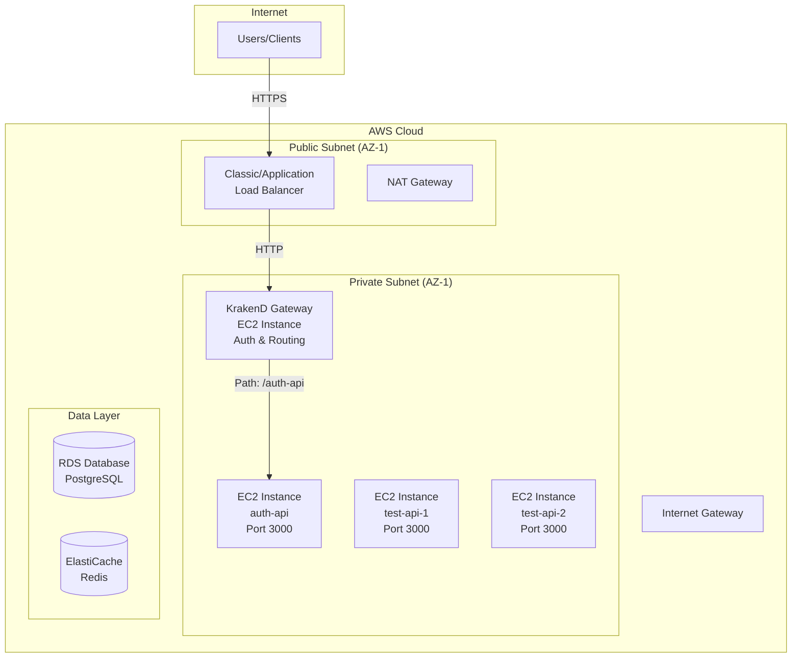
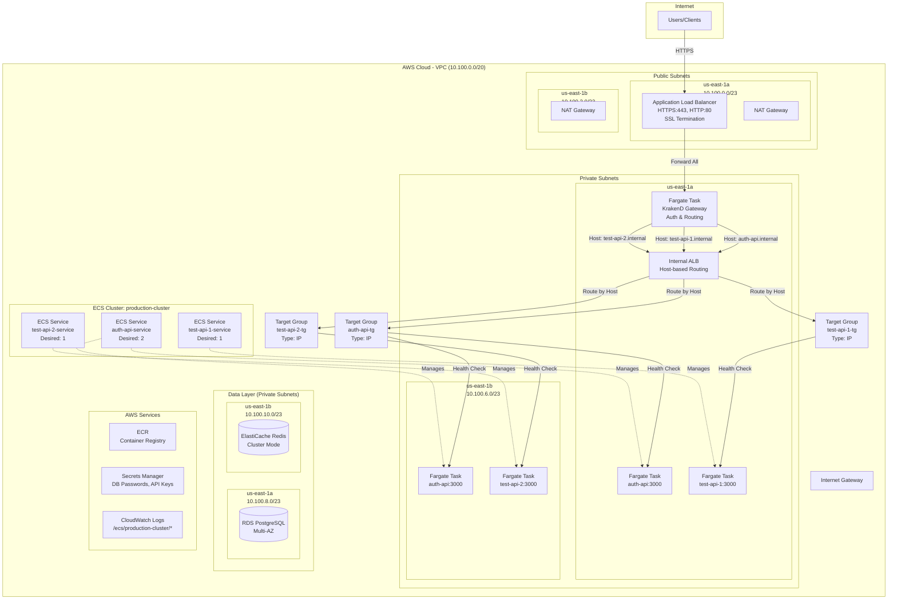

# EC2 to ECS Fargate Brownfield Migration Plan

## Overview

This is a **comprehensive, phase-by-phase migration plan** for moving existing EC2-based applications to AWS ECS Fargate in a brownfield (existing production) environment. This plan orchestrates multiple specialized sub-plans to guide teams through a safe, zero-downtime migration, adopting the **12-Factor App** methodology.

**Plan Type:** Meta-plan (Plan of Plans)  
**Audience:** DevOps teams, platform engineers, technical leads  
**Scope:** Complete brownfield migration from EC2 to containerized Fargate workloads

**Key Benefits:**

- No server patching or maintenance
- Automatic scaling based on demand
- Faster deployments with rollback capability
- Pay only for compute time used
- Consistent environments (dev = staging = prod)

---

## Plan Architecture

This migration plan **references and coordinates** specialized plans for different aspects of the migration:

### 📋 Referenced Plans

1. **[Terraform Bootstrap Plan](../terraform-bootstrap-plan/README.md)**
   - Covered in: Phase -1, Story 3.2
   - Sets up Terraform state backend (S3 + DynamoDB)
   - Enables team collaboration on infrastructure code
   - **Complete this before starting Phase 2**

2. **[Prepare App for 12-Factor Plan](../prepare-app-for-12-factor-plan/README.md)** ⭐ **PREREQUISITE**
   - **Must complete before containerization**
   - Externalizes configuration and secrets
   - Eliminates ephemeral filesystem dependencies
   - Implements stdout logging and health checks
   - Migrates sessions to Redis/database
   - Replaces cron with EventBridge
   - Configures proxy headers and connection pooling
   - **Team:** Development team
   - **Duration:** 2-4 weeks
   - **Can be validated on EC2 before Docker**

3. **[Containerizing Services Plan](../containerizing-services-plan/README.md)** ⭐ **PREREQUISITE**
   - **Must complete after 12-Factor preparation**
   - Creates production-ready Dockerfiles
   - Implements PID 1 handling and graceful shutdown
   - Optimizes container startup and resource usage
   - Implements container security (non-root, scanning)
   - **Team:** DevOps/Platform team
   - **Duration:** 1-2 weeks
   - **Validates Docker best practices**

4. **[AWS Identity Center Provider Migration Plan](../aws-identity-center-provider-migration-plan/README.md)** _(if applicable)_
   - Authentication provider consolidation
   - SSO migration strategies
   - Identity federation patterns

5. **[ECS Greenfield MVP Plan](../ecs-greenfield-mvp-plan/README.md)** _(reference for new patterns)_
   - Modern ECS patterns for comparison
   - Greenfield best practices
   - Future-state architecture examples

---

## Network Architecture

### Pre-Migration Architecture (EC2-Based)



### Post-Migration Architecture (ECS Fargate)



---

## Migration Phases

This plan follows a phased approach with clear dependencies and checkpoints:

### Phase -1: [Prerequisites & Local Setup](plan/phase-0-prerequisites.md)

- **Duration:** 1-2 days
- **Deliverables:** AWS access, tools installed, repository structure
- **References:** [Terraform Bootstrap Plan](../terraform-bootstrap-plan/README.md) for state backend

### Phase 0: [Discovery](plan/phase-1-discovery.md)

- **Duration:** 3-5 days
- **Deliverables:** Infrastructure inventory, migration blockers identified
- **Checkpoint:** Discovery review meeting

### Phase 1: Application Readiness ⭐ **NOW TWO SEPARATE PLANS**

**This phase has been split into two specialized plans for better team ownership:**

#### Phase 1a: [Prepare App for 12-Factor Plan](../prepare-app-for-12-factor-plan/README.md)

- **Duration:** 2-4 weeks
- **Team:** Development team
- **Deliverables:**
  - Configuration externalized to environment variables
  - Sessions stored in Redis/database
  - Logs output to stdout
  - Health check endpoints implemented
  - File storage migrated to S3
  - Cron jobs migrated to EventBridge
  - Background workers separated
  - Proxy headers configured
  - Database connection pooling implemented
- **Checkpoint:** All changes validated on EC2 **before** containerization
- **Key Benefit:** Can test 12-Factor patterns on existing EC2 infrastructure

#### Phase 1b: [Containerizing Services Plan](../containerizing-services-plan/README.md)

- **Duration:** 1-2 weeks
- **Team:** DevOps/Platform team
- **Prerequisites:** Phase 1a complete and validated on EC2
- **Deliverables:**
  - Production-ready Dockerfiles
  - PID 1 handling (tini) configured
  - Graceful shutdown (SIGTERM) implemented
  - Multi-architecture images (ARM64 + x86_64)
  - Container startup optimized
  - Security hardening (non-root user, image scanning)
  - docker-compose for local development
- **Checkpoint:** Containers tested locally and pass all security scans

### Phase 2: [Infrastructure Setup](plan/phase-3-infrastructure-setup.md)

- **Duration:** 1-2 weeks
- **Deliverables:** Imported existing infra, new Fargate infrastructure provisioned
- **Checkpoint:** Infrastructure validated, zero production impact
- **Key Story:** Import existing infrastructure to Terraform (brownfield-specific)

### Phase 3: [Initial Deployment](plan/phase-4-initial-deployment.md)

- **Duration:** 1 week
- **Deliverables:** First application running on Fargate
- **Checkpoint:** First service deployed, health checks passing

### Phase 4: [Deployment Artifacts](plan/phase-4-initial-deployment.md)

- **Duration:** 3-5 days
- **Deliverables:** Reusable CI/CD templates, Task definitions
- **Checkpoint:** Pipeline successfully deploys to Fargate

### Phase 5: [Scaling & Automation](plan/phase-5-scaling/README.md)

- **Duration:** 1 week
- **Deliverables:** Operational Excellence (Monitoring, Auto-scaling), IaC modules
- **Checkpoint:** Systems ready for production scale without manual intervention

### Phase 6: [Cutover & Cleanup](plan/phase-6-cutover-cleanup/README.md)

- **Duration:** 1-2 weeks
- **Deliverables:** Strangler Fig routing, Traffic shifted, Legacy EC2 decommissioned
- **Checkpoint:** 100% Traffic on Fargate, Old infrastructure terminated

---

## Phase Visualization

```
        ▼                       ▼
┌───────────────────┐   ┌───────────────────┐
│ PHASE 1 (App)     │   │ PHASE 2 (Infra)   │
│ • Dockerfile      │   │ • VPC/Subnets     │
│ • 12-factor fixes │   │ • ALB + ACM cert  │
│ • Env vars        │   │ • ECS Cluster     │
│ • Logging stdout  │   │ • ECR repos       │
│ • Health endpoint │   │ • IAM roles       │
│ • Local testing   │   │ • Secrets Manager │
└────────┬──────────┘   └────────┬──────────┘
         │                       │
         └───────────┬───────────┘
                     ▼
         ┌───────────────────────┐
         │ PHASE 3 & 4 (Setup)   │
         │ • Security groups     │
         │ • Task definition     │
         │ • ECS Service         │
         │ • CI/CD pipeline      │
         └───────────┬───────────┘
                     ▼
         ┌───────────────────────┐
         │ PHASE 5 (SCALING)     │
         │ • Reusable workflows  │
         │ • Service discovery   │
         │ • IaC (Terraform)     │
         │ • Auto-scaling        │
         └───────────┬───────────┘
                     ▼
         ┌───────────────────────┐
         │ PHASE 6 (CUTOVER)     │
         │ • Strangler Fig       │
         │ • Canary Release      │
         │ • Decommission EC2    │
         └───────────────────────┘
```

---

## Team Responsibilities

### App Teams (Phase 1)

| Task                              | Deliverable                           |
| --------------------------------- | ------------------------------------- |
| Create Dockerfile                 | Working `docker build` + `docker run` |
| Refactor to environment variables | No hardcoded config or secrets        |
| Implement `/health` endpoint      | Returns 200 OK quickly                |
| Log to STDOUT/STDERR              | No file-based logging                 |
| Handle SIGTERM gracefully         | Clean shutdown within 30s             |
| Move sessions to Redis/DB         | No local session storage              |
| Remove filesystem dependencies    | Use S3 for uploads                    |
| Test locally                      | `docker run -e VAR=value` works       |

### Infrastructure Team (Phase 2)

| Task                                | Deliverable                            |
| ----------------------------------- | -------------------------------------- |
| Create/configure VPC                | Public + private subnets in 2 AZs      |
| Set up NAT Gateway or VPC Endpoints | Private subnets have internet access   |
| Create ALB                          | Internet-facing with HTTPS listener    |
| Request ACM certificate             | Validated and attached to ALB          |
| Create ECS Cluster                  | Container Insights enabled             |
| Create ECR repositories             | With lifecycle policies                |
| Set up Secrets Manager              | All secrets migrated                   |
| Create IAM roles                    | OIDC trust, Task Execution, Task roles |
| Create CloudWatch Log Groups        | With retention policies                |

---

## Migration Sequence (Recommended)

Migrate applications in dependency order—start with apps that have no internal dependencies:

```
Wave 1: Independent Services (no internal deps)
├── auth-api          ← Often first (other services depend on it)
└── notification-svc  ← Usually standalone

Wave 2: Core Services
├── user-api          ← May depend on auth-api
└── billing-api       ← May depend on auth-api

Wave 3: Dependent Services
├── admin-panel       ← Depends on user-api, auth-api
└── reporting-svc     ← Depends on multiple services

Wave 4: Frontend / Gateway
└── krakend / api-gw  ← Migrate last (routes to all services)
```

---

## Migration Timeline & Dependencies

```
Phase -1: Prerequisites (1-2 days)
    ↓
Phase 0: Discovery (3-5 days)
    ↓
Phase 1a: 12-Factor App Preparation (2-4 weeks) ← Development Team
    ↓ Validate on EC2
Phase 1b: Containerization (1-2 weeks) ← DevOps Team
    ↓ Test locally with Docker
Phase 2: Infrastructure Setup (1-2 weeks)
    ↓
Phase 3: Initial Deployment (1 week)
    ↓
Phase 4: Deployment Artifacts (3-5 days)
    ↓
Phase 5: Scaling & Automation (1 week)
    ↓
Phase 6: Cutover & Cleanup (1-2 weeks)

Total Duration: 8-16 weeks
```

---

## Key Differentiators (Brownfield Focus)

This plan is specifically designed for **brownfield migrations** with existing production infrastructure:

✅ **Import existing resources** into Terraform before creating new ones  
✅ **Zero-downtime migration** with gradual traffic shifting  
✅ **Coexistence period** where EC2 and Fargate run simultaneously  
✅ **Rollback strategies** at every phase  
✅ **Production-first mindset** with extensive validation gates

---

## Appendix Documents

These themed reference documents support the migration phases:

### 1. [AWS Authentication and Security](appendix/aws-authentication-and-security.md)

_Setting up AWS CLI access, configuring GitHub Actions authentication, and implementing security best practices._

### 2. [ECS Deployment Fundamentals](appendix/ecs-deployment-fundamentals.md)

_Understanding tasks, services, ALBs, and deployment sequences._

### 3. [Networking and Security Groups](appendix/networking-and-security-groups.md)

_Configuring shared vs service-specific security groups and network isolation._

### 4. [GitHub Actions CI/CD](appendix/github-actions-cicd.md)

_Setting up pipelines, secrets management, and reusable workflows._

### 5. [Secrets Management](appendix/secrets-management.md)

_Migrating from .env files to AWS Secrets Manager._

### 6. [Troubleshooting and Operations](appendix/troubleshooting-and-operations.md)

_Debugging deployment failures, task restarts, and networking issues._

### 7. [Terraform Organization Guide](appendix/terraform-organization-guide.md)

_Structure for brownfield migrations and state management._

### 8. [Docker Base Image Strategy](appendix/docker-base-image-strategy.md)

_Deciding on custom base images vs public images for security and standardization._

---

## Quick Reference: Common Traps

| Trap                            | Symptom                                  | Phase to Fix |
| ------------------------------- | ---------------------------------------- | ------------ |
| App binds to `localhost`        | Health checks fail, connection refused   | Phase 1      |
| No NAT Gateway                  | Tasks stuck in PENDING, can't pull image | Phase 2      |
| Database SG missing Fargate SG  | Database connection refused              | Phase 3      |
| No `/health` endpoint           | Tasks killed before ready                | Phase 1      |
| Secrets hardcoded               | Works locally, fails in Fargate          | Phase 1      |
| Logs to files                   | Zero visibility into errors              | Phase 1      |
| Wrong Docker architecture       | "exec format error"                      | Phase 1      |
| Sessions in local memory        | Users randomly logged out                | Phase 1      |
| Calling services via public URL | Latency + NAT costs                      | Phase 4      |

---

## Success Criteria

### Per Application

- [ ] Container starts and passes health checks
- [ ] CI/CD deploys automatically on push to main
- [ ] Logs visible in CloudWatch
- [ ] No secrets in code or Docker image
- [ ] Handles traffic without errors
- [ ] Graceful shutdown works

### Overall Migration

- [ ] All applications running on Fargate
- [ ] EC2 instances terminated
- [ ] Reusable workflow template in use
- [ ] Auto-scaling configured
- [ ] Monitoring and alerting active
- [ ] Cost within expected range
- [ ] Documentation complete
