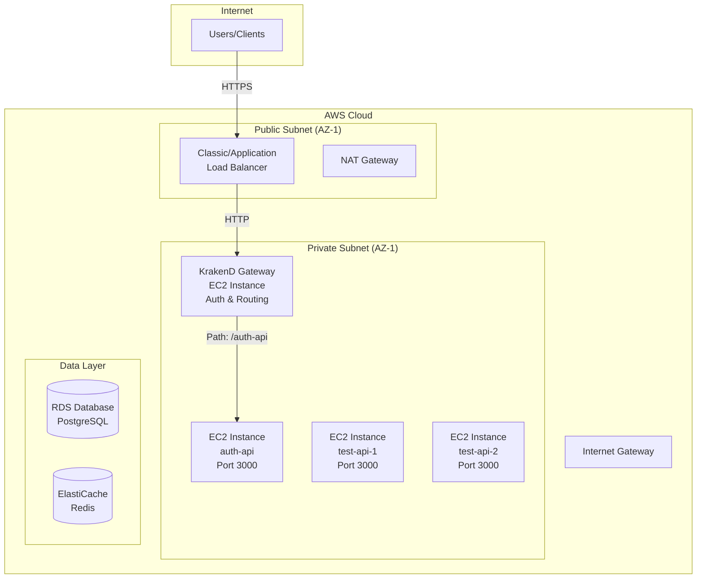
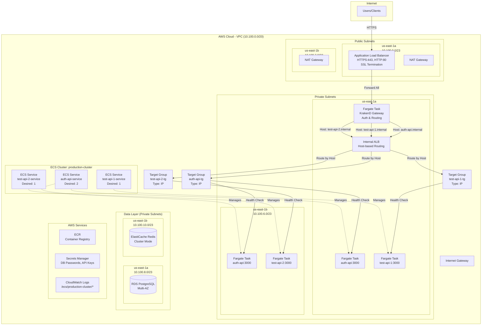

# EC2 to ECS Fargate Brownfield Migration Plan

## Overview

This is a **comprehensive, phase-by-phase migration plan** for moving existing EC2-based applications to AWS ECS Fargate in a brownfield (existing production) environment. This plan orchestrates multiple specialized sub-plans to guide teams through a safe, zero-downtime migration, adopting the **12-Factor App** methodology.

**Audience:** DevOps teams, platform engineers, technical leads  
**Scope:** Complete brownfield migration from EC2 to containerized Fargate workloads

**Key Benefits:**

- No server patching or maintenance
- Automatic scaling based on demand
- Faster deployments with rollback capability
- Pay only for compute time used
- Consistent environments (dev = staging = prod)

---

## How to Use This Repository

This repository acts as a **Meta-plan** (Plan of Plans). It coordinates multiple specialized sub-plans (found in `phase-*` directories or external folders like `terraform-state-bootstrap-plan`) to guide you through the entire migration journey.

- **Start here**: Understand the high-level flow and dependencies.
- **Drill down**: Follow links to specialized plans for implementation details.
- **Contribute**: Updates should be atomic and focused on specific phases.

---

## Migration Strategy: Multi-Account Architecture

This migration leverages a **Multi-Account AWS Organization** strategy to enhance security, isolation, and scalability.

- **Management Account:** AWS Organizations, consolidated billing, and SSO (Identity Center).
- **Network/Platform Account:** Shared networking (VPC, Transit Gateway), shared services, and CI/CD pipelines.
- **Workload Accounts (Dev/Prod):** Dedicated accounts for application workloads (ECS Clusters, Services, Tasks).

This separation ensures that application deployments in `dev` or `prod` do not impact the core networking infrastructure.

### 📋 Referenced Plans

1. **[Terraform State Bootstrap Plan](../terraform-state-bootstrap-plan/README.md)**
   - Covered in: Phase 0
   - Sets up Terraform state backend (S3 + DynamoDB) per account/layer
   - Enables team collaboration on infrastructure code
   - **Note:** This is a separate project with its own Phases (0-8). Complete at least Phases 0-5 of the Bootstrap Plan before proceeding to Phase 2 (Infrastructure Setup) of this migration.

2. **[Prepare App for 12-Factor Plan](phase-2-application-readiness/12-factor-prep/README.md)** ⭐ **PREREQUISITE**
   - **Must complete before containerization**
   - Externalizes configuration and secrets
   - Eliminates ephemeral filesystem dependencies
   - Implements stdout logging and health checks
   - Migrates sessions to Redis/database
   - Replaces cron with EventBridge
   - Configures proxy headers and connection pooling
   - **Team:** Development team
   - **Duration:** 2-4 weeks
   - **Can be validated on EC2 before Docker**

3. **[Containerizing Services Plan](phase-2-application-readiness/containerizing-services/README.md)** ⭐ **PREREQUISITE**
   - **Must complete after 12-Factor preparation**
   - Creates production-ready Dockerfiles
   - Implements PID 1 handling and graceful shutdown
   - Optimizes container startup and resource usage
   - Implements container security (non-root, scanning)
   - **Team:** DevOps/Platform team
   - **Duration:** 1-2 weeks
   - **Validates Docker best practices**

4. **[AWS Identity Center Provider Migration Plan](../aws-identity-center-provider-migration-plan/README.md)** _(if applicable)_
   - Authentication provider consolidation
   - SSO migration strategies
   - Identity federation patterns

---

## Network Architecture

### Pre-Migration Architecture (EC2-Based)



### Post-Migration Architecture (ECS Fargate)



---

## Migration Phases

This plan follows a phased approach with clear dependencies and checkpoints:

### Phase 0: Prerequisites

- **Duration:** 1-2 days
- **Deliverables:**
  - Developers onboarded
  - Initialize the shared infrastructure repository.
  - Initialize the application deployment repository.

### Phase 1: [Discovery](phase-1-discovery/README.md)

- **Duration:** 3-5 days
- **Deliverables:**
  - Infrastructure inventory,
  - migration blockers identified
- **Checkpoint:** Discovery review meeting

### Phase 2: Application Readiness

**This phase has been split into two specialized plans for better team ownership:**

#### Phase 2a: [Prepare App for 12-Factor Plan](phase-2-application-readiness/12-factor-prep/README.md)

- **Duration:** 2-4 weeks
- **Team:** Development team
- **Deliverables:**
  - Configuration externalized to environment variables
  - Sessions stored in Redis/database
  - Logs output to stdout
  - Health check endpoints implemented
  - File storage migrated to S3
  - Cron jobs migrated to EventBridge
  - Background workers separated
  - Proxy headers configured
  - Database connection pooling implemented
- **Checkpoint:** All changes validated on EC2 **before** containerization
- **Key Benefit:** Can test 12-Factor patterns on existing EC2 infrastructure

#### Phase 2b: [Containerizing Services Plan](phase-2-application-readiness/containerizing-services/README.md)

- **Duration:** 1-2 weeks
- **Team:** DevOps/Platform team
- **Prerequisites:** Phase 2a complete and validated on EC2
- **Deliverables:**
  - Production-ready Dockerfiles
  - PID 1 handling (tini) configured
  - Graceful shutdown (SIGTERM) implemented
  - Multi-architecture images (ARM64 + x86_64)
  - Container startup optimized
  - Security hardening (non-root user, image scanning)
  - docker-compose for local development
- **Checkpoint:** Containers tested locally and pass all security scans

### Phase 3: [Infrastructure Setup](phase-3-infrastructure-setup/README.md)

- **Duration:** 2-3 weeks
- **Deliverables:**
  - Imported existing network and application resources (Terraform)
  - Shared Infrastructure Created (ALB, ECS Cluster, Service Discovery)
  - Security Infrastructure (Security Groups, IAM Roles)
  - Artifact Management (ECR Repositories)
- **Checkpoint:** Infrastructure validated, state matches reality, zero production impact
- **Key Story:** Import existing infrastructure to Terraform (brownfield-specific)

### Phase 4: [Initial Deployment](phase-4-initial-deployment/README.md)

- **Duration:** 1 week
- **Deliverables:** First application running on Fargate, Reusable CI/CD templates, Task definitions
- **Checkpoint:** First service deployed, health checks passing

### Phase 5: [Scaling & Automation](phase-5-scaling/README.md)

- **Duration:** 1 week
- **Deliverables:** Operational Excellence (Monitoring, Auto-scaling), IaC modules
- **Checkpoint:** Systems ready for production scale without manual intervention

### Phase 6: [Cutover & Cleanup](phase-6-cutover-cleanup/README.md)

- **Duration:** 1-2 weeks
- **Deliverables:** Strangler Fig routing, Traffic shifted, Legacy EC2 decommissioned
- **Checkpoint:** 100% Traffic on Fargate, Old infrastructure terminated

### Phase X: [Optimizations & Future Features](phase-x-optimizations/README.md)

- **Duration:** Ongoing (Post-Migration)
- **Deliverables:** Cost optimization, Enhanced security, Advanced networking
- **Key Features:** Service Connect, Karpenter, Fargate Spot, Private Link
- **Note:** These are "Day 2" operations to be tackled after the migration is stable.

---

## Phase Visualization

```
        ▼                       ▼
┌───────────────────┐   ┌───────────────────┐
│ PHASE 2 (App)     │   │ PHASE 3 (Infra)   │
│ • Dockerfile      │   │ • VPC/Subnets     │
│ • 12-factor fixes │   │ • ALB + ACM cert  │
│ • Env vars        │   │ • ECS Cluster     │
│ • Logging stdout  │   │ • ECR repos       │
│ • Health endpoint │   │ • IAM roles       │
│ • Local testing   │   │ • Secrets Manager │
└────────┬──────────┘   └────────┬──────────┘
         │                       │
         └───────────┬───────────┘
                     ▼
         ┌───────────────────────┐
         │ PHASE 4 (Deploy)      │
         │ • Security groups     │
         │ • Task definition     │
         │ • ECS Service         │
         │ • CI/CD pipeline      │
         └───────────┬───────────┘
                     ▼
         ┌───────────────────────┐
         │ PHASE 5 (SCALING)     │
         │ • Reusable workflows  │
         │ • Service discovery   │
         │ • IaC (Terraform)     │
         │ • Auto-scaling        │
         └───────────┬───────────┘
                     ▼
         ┌───────────────────────┐
         │ PHASE 6 (CUTOVER)     │
         │ • Strangler Fig       │
         │ • Canary Release      │
         │ • Decommission EC2    │
         └───────────────────────┘
```

---

## Team Responsibilities

### App Teams (Phase 1)

| Task                              | Deliverable                           |
| --------------------------------- | ------------------------------------- |
| Create Dockerfile                 | Working `docker build` + `docker run` |
| Refactor to environment variables | No hardcoded config or secrets        |
| Implement `/health` endpoint      | Returns 200 OK quickly                |
| Log to STDOUT/STDERR              | No file-based logging                 |
| Handle SIGTERM gracefully         | Clean shutdown within 30s             |
| Move sessions to Redis/DB         | No local session storage              |
| Remove filesystem dependencies    | Use S3 for uploads                    |
| Test locally                      | `docker run -e VAR=value` works       |

### Infrastructure Team (Phase 2)

| Task                                | Deliverable                            |
| ----------------------------------- | -------------------------------------- |
| Create/configure VPC                | Public + private subnets in 2 AZs      |
| Set up NAT Gateway or VPC Endpoints | Private subnets have internet access   |
| Create ALB                          | Internet-facing with HTTPS listener    |
| Request ACM certificate             | Validated and attached to ALB          |
| Create ECS Cluster                  | Container Insights enabled             |
| Create ECR repositories             | With lifecycle policies                |
| Set up Secrets Manager              | All secrets migrated                   |
| Create IAM roles                    | OIDC trust, Task Execution, Task roles |
| Create CloudWatch Log Groups        | With retention policies                |

---

## Migration Sequence (Recommended)

Migrate applications in dependency order—start with apps that have no internal dependencies:

```
Wave 1: Independent Services (no internal deps)
├── auth-api          ← Often first (other services depend on it)
└── notification-svc  ← Usually standalone

Wave 2: Core Services
├── user-api          ← May depend on auth-api
└── billing-api       ← May depend on auth-api

Wave 3: Dependent Services
├── admin-panel       ← Depends on user-api, auth-api
└── reporting-svc     ← Depends on multiple services

Wave 4: Frontend / Gateway
└── krakend / api-gw  ← Migrate last (routes to all services)
```
