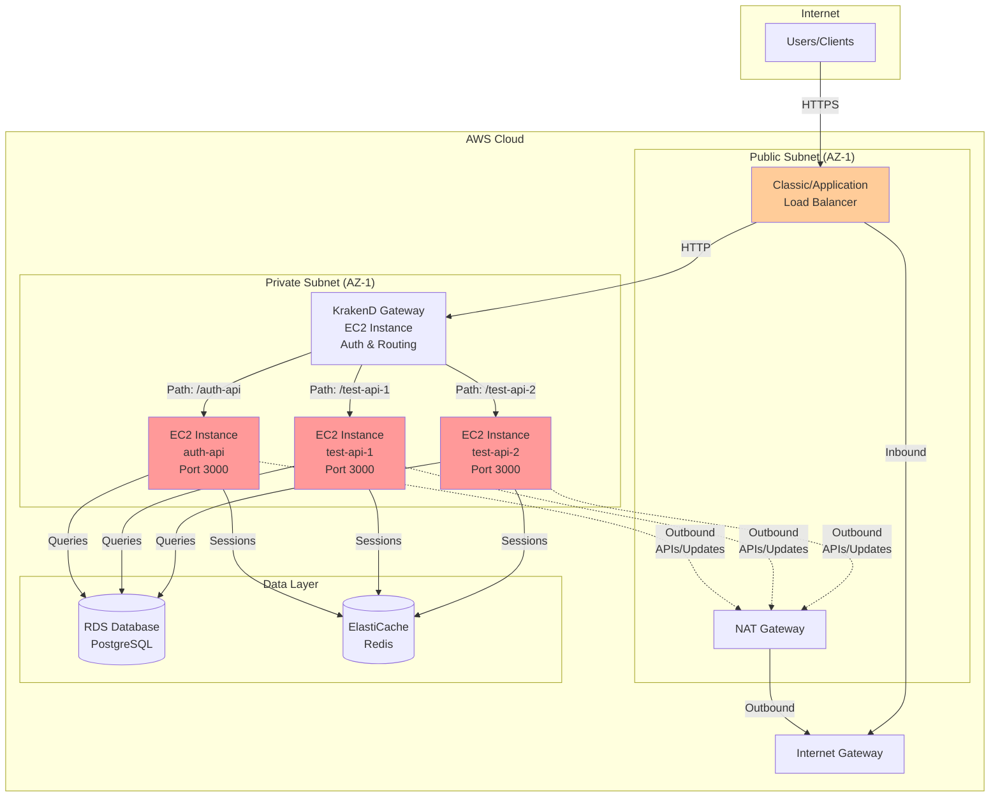
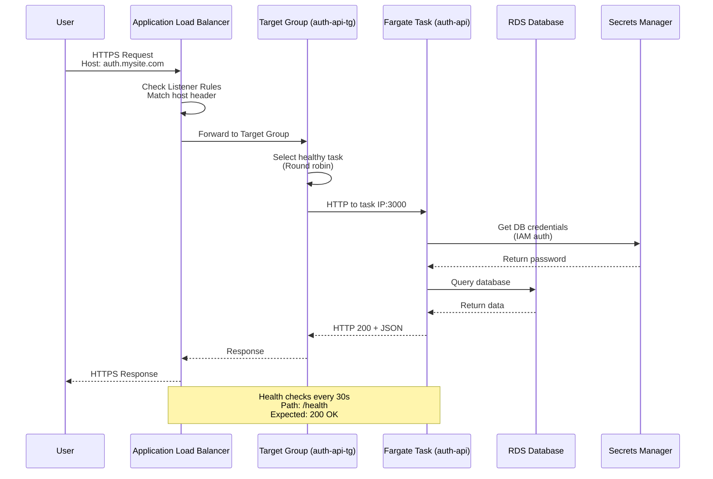

# ECS Fargate Migration Plan - Overview

## Introduction

This migration moves applications from EC2 instances to ECS Fargate, adopting the **12-Factor App** methodology. The result: immutable, scalable, containerized applications with automated CI/CD.

**Key Benefits:**

- No server patching or maintenance
- Automatic scaling based on demand
- Faster deployments with rollback capability
- Pay only for compute time used
- Consistent environments (dev = staging = prod)

---

## Network Architecture

### Pre-Migration Architecture (EC2-Based)



**Current Architecture:**

- **KrakenD API Gateway** handles authentication, security, and path-based routing
- Path-based routing (e.g., `/test-api-1/*`) forwards to backend services
- KrakenD strips paths and uses host-based forwarding

**Challenges:**

- Manual server patching and OS updates (including KrakenD host)
- Fixed capacity (must overprovision for peak)
- Deployment requires SSH, manual restarts
- Configuration drift between instances
- Load balancer routing to instance IDs
- KrakenD is a single point of failure on EC2

---

### Post-Migration Architecture (ECS Fargate)

```mermaid
graph TB
    subgraph Internet
        Users[Users/Clients]
        GitHub[GitHub Actions<br/>CI/CD]
    end

    subgraph AWS_Cloud["AWS Cloud - VPC (10.100.0.0/20)"]

        subgraph Public_Subnets["Public Subnets"]
            subgraph Public_AZ1["us-east-1a<br/>10.100.0.0/23"]
                ALB[Application Load Balancer<br/>HTTPS:443, HTTP:80<br/>SSL Termination]
                NAT1[NAT Gateway]
            end
            subgraph Public_AZ2["us-east-1b<br/>10.100.2.0/23"]
                NAT2[NAT Gateway]
            end
        end

        subgraph Private_Subnets["Private Subnets"]
            subgraph Private_AZ1["us-east-1a<br/>10.100.4.0/23"]
                KrakenD_Task[Fargate Task<br/>KrakenD Gateway<br/>Auth & Routing]
                Fargate1A[Fargate Task<br/>auth-api:3000]
                Fargate2A[Fargate Task<br/>test-api-1:3000]
                InternalALB[Internal ALB<br/>Host-based Routing]
            end
            subgraph Private_AZ2["us-east-1b<br/>10.100.6.0/23"]
                Fargate1B[Fargate Task<br/>auth-api:3000]
                Fargate3B[Fargate Task<br/>test-api-2:3000]
            end
        end

        subgraph ECS["ECS Cluster: production-cluster"]
            Service1[ECS Service<br/>auth-api-service<br/>Desired: 2]
            Service2[ECS Service<br/>test-api-1-service<br/>Desired: 1]
            Service3[ECS Service<br/>test-api-2-service<br/>Desired: 1]
        end

        subgraph Data_Layer["Data Layer (Private Subnets)"]
            subgraph Data_AZ1["us-east-1a<br/>10.100.8.0/23"]
                RDS[(RDS PostgreSQL<br/>Multi-AZ)]
            end
            subgraph Data_AZ2["us-east-1b<br/>10.100.10.0/23"]
                Redis[(ElastiCache Redis<br/>Cluster Mode)]
            end
        end

        subgraph AWS_Services["AWS Services"]
            ECR[ECR<br/>Container Registry]
            SecretsManager[Secrets Manager<br/>DB Passwords, API Keys]
            CloudWatch[CloudWatch Logs<br/>/ecs/production-cluster/*]
        end

        IGW[Internet Gateway]

        TG1[Target Group<br/>auth-api-tg<br/>Type: IP]
        TG2[Target Group<br/>test-api-1-tg<br/>Type: IP]
        TG3[Target Group<br/>test-api-2-tg<br/>Type: IP]
    end

    subgraph GitHub_OIDC["GitHub OIDC Authentication"]
        OIDC[OIDC Provider<br/>token.actions.githubusercontent.com]
        IAM_Role[IAM Role<br/>github-deployer<br/>Trust: GitHub repos]
    end

    Users -->|HTTPS| ALB
    ALB -->|Forward All| KrakenD_Task
    KrakenD_Task -->|Host: auth-api.internal| InternalALB
    KrakenD_Task -->|Host: test-api-1.internal| InternalALB
    KrakenD_Task -->|Host: test-api-2.internal| InternalALB

    GitHub -.->|Assume Role<br/>OIDC| OIDC
    OIDC -.->|Temporary Credentials| IAM_Role
    GitHub -->|Push Image| ECR
    GitHub -->|Update Service| Service1
    GitHub -->|Update Service| Service2
    GitHub -->|Update Service| Service3

    InternalALB -->|Route by Host| TG1
    InternalALB -->|Route by Host| TG2
    InternalALB -->|Route by Host| TG3

    TG1 -->|Health Check| Fargate1A
    TG1 -->|Health Check| Fargate1B
    TG2 -->|Health Check| Fargate2A
    TG3 -->|Health Check| Fargate3B

    Service1 -.->|Manages| Fargate1A
    Service1 -.->|Manages| Fargate1B
    Service2 -.->|Manages| Fargate2A
    Service3 -.->|Manages| Fargate3B

    Fargate1A -->|Pull Image| ECR
    Fargate1B -->|Pull Image| ECR
    Fargate2A -->|Pull Image| ECR
    Fargate3B -->|Pull Image| ECR

    Fargate1A -->|Get Secrets| SecretsManager
    Fargate2A -->|Get Secrets| SecretsManager
    Fargate3B -->|Get Secrets| SecretsManager

    Fargate1A -->|Logs| CloudWatch
    Fargate1B -->|Logs| CloudWatch
    Fargate2A -->|Logs| CloudWatch
    Fargate3B -->|Logs| CloudWatch

    Fargate1A -->|SQL| RDS
    Fargate1B -->|SQL| RDS
    Fargate2A -->|SQL| RDS
    Fargate3B -->|SQL| RDS

    Fargate1A -->|Cache| Redis
    Fargate1B -->|Cache| Redis
    Fargate2A -->|Cache| Redis
    Fargate3B -->|Cache| Redis

    Fargate1A -.->|Outbound<br/>External APIs| NAT1
    Fargate2A -.->|Outbound<br/>External APIs| NAT1
    Fargate1B -.->|Outbound<br/>External APIs| NAT2
    Fargate3B -.->|Outbound<br/>External APIs| NAT2

    NAT1 -->|Internet| IGW
    NAT2 -->|Internet| IGW
    ALB -->|Inbound| IGW

    style Fargate1A fill:#99ccff
    style Fargate1B fill:#99ccff
    style Fargate2A fill:#99ccff
    style Fargate3B fill:#99ccff
    style ALB fill:#99ff99
    style ECR fill:#ffeb99
    style SecretsManager fill:#ffeb99
    style CloudWatch fill:#ffeb99
    style Service1 fill:#d0b0ff
    style Service2 fill:#d0b0ff
    style Service3 fill:#d0b0ff
```



**Improvements:**

- ✅ Serverless compute (no patching)
- ✅ Auto-scaling based on CPU/memory/requests
- ✅ Multi-AZ high availability
- ✅ Automated deployments via GitHub Actions
- ✅ Immutable infrastructure (no drift)
- ✅ IP-based routing (dynamic task IPs)
- ✅ Centralized logging to CloudWatch
- ✅ Secrets managed in AWS Secrets Manager
- ✅ OIDC authentication (no long-lived keys)

---

### Traffic Flow Detail



---

## Document Index

| Phase | Document                                                                     | Owner      | Description                        |
| ----- | ---------------------------------------------------------------------------- | ---------- | ---------------------------------- |
| 0     | [Discovery](ecs-migration-plan-phase-0-discovery.md)                         | Both Teams | Audit VPC, secrets, dependencies   |
| 1     | [Application Readiness](ecs-migration-plan-phase-1-application-readiness.md) | App Teams  | Dockerize, 12-factor compliance    |
| 2     | [Infrastructure Setup](ecs-migration-plan-phase-2-infrastructure-setup.md)   | Infra Team | VPC, ALB, ECS Cluster, IAM         |
| 3     | [Initial Deployment](ecs-migration-plan-phase-3-initial-deployment.md)       | Both Teams | First app deployment + CI/CD       |
| 4     | [Scaling the Migration](ecs-migration-plan-phase-4-scaling-the-migration.md) | Both Teams | Remaining apps, reusable workflows |

---

## Parallel Execution Model

**App Teams and Infrastructure can work in parallel after Phase 0.**

```
Timeline:        Week 1          Week 2          Week 3          Week 4
                    │               │               │               │
┌─────────────────────────────────────────────────────────────────────────┐
│ PHASE 0: Discovery (BOTH TEAMS - must complete first)                   │
│ • VPC audit, secrets inventory, service dependencies                    │
└───────────────────┬─────────────────────────────────────────────────────┘
                    │
        ┌───────────┴───────────┐
        ▼                       ▼
┌───────────────────┐   ┌───────────────────┐
│ PHASE 1 (App)     │   │ PHASE 2 (Infra)   │
│ • Dockerfile      │   │ • VPC/Subnets     │
│ • 12-factor fixes │   │ • ALB + ACM cert  │
│ • Env vars        │   │ • ECS Cluster     │
│ • Logging stdout  │   │ • ECR repos       │
│ • Health endpoint │   │ • IAM roles       │
│ • Local testing   │   │ • Secrets Manager │
└────────┬──────────┘   └────────┬──────────┘
         │                       │
         └───────────┬───────────┘
                     ▼
         ┌───────────────────────┐
         │ PHASE 3 (BOTH)        │
         │ • Security groups     │
         │ • Task definition     │
         │ • ECS Service         │
         │ • CI/CD pipeline      │
         │ • Cutover             │
         └───────────┬───────────┘
                     ▼
         ┌───────────────────────┐
         │ PHASE 4 (BOTH)        │
         │ • Reusable workflows  │
         │ • Service discovery   │
         │ • Remaining apps      │
         │ • Auto-scaling        │
         └───────────────────────┘
```

---

## Team Responsibilities

### App Teams (Phase 1)

| Task                              | Deliverable                           |
| --------------------------------- | ------------------------------------- |
| Create Dockerfile                 | Working `docker build` + `docker run` |
| Refactor to environment variables | No hardcoded config or secrets        |
| Implement `/health` endpoint      | Returns 200 OK quickly                |
| Log to STDOUT/STDERR              | No file-based logging                 |
| Handle SIGTERM gracefully         | Clean shutdown within 30s             |
| Move sessions to Redis/DB         | No local session storage              |
| Remove filesystem dependencies    | Use S3 for uploads                    |
| Test locally                      | `docker run -e VAR=value` works       |

### Infrastructure Team (Phase 2)

| Task                                | Deliverable                            |
| ----------------------------------- | -------------------------------------- |
| Create/configure VPC                | Public + private subnets in 2 AZs      |
| Set up NAT Gateway or VPC Endpoints | Private subnets have internet access   |
| Create ALB                          | Internet-facing with HTTPS listener    |
| Request ACM certificate             | Validated and attached to ALB          |
| Create ECS Cluster                  | Container Insights enabled             |
| Create ECR repositories             | With lifecycle policies                |
| Set up Secrets Manager              | All secrets migrated                   |
| Create IAM roles                    | OIDC trust, Task Execution, Task roles |
| Create CloudWatch Log Groups        | With retention policies                |

---

## Handoff Points (Sync Required)

These items require coordination between teams:

| Item                         | App Team Provides                | Infra Team Needs                   |
| ---------------------------- | -------------------------------- | ---------------------------------- |
| **Application Port**         | Port app listens on (e.g., 3000) | For security groups, target groups |
| **Environment Variables**    | List of all required vars        | To create in Secrets Manager       |
| **AWS Service Dependencies** | S3 buckets, SQS queues, etc.     | To create Task Role permissions    |
| **Health Check Path**        | Endpoint path (e.g., `/health`)  | For ALB target group config        |
| **Service-to-Service Calls** | Which apps call which            | To plan Cloud Map DNS names        |
| **Resource Requirements**    | CPU/memory estimates             | For task definition sizing         |

---

## Migration Sequence (Recommended)

Migrate applications in dependency order—start with apps that have no internal dependencies:

```
Wave 1: Independent Services (no internal deps)
├── auth-api          ← Often first (other services depend on it)
└── notification-svc  ← Usually standalone

Wave 2: Core Services
├── user-api          ← May depend on auth-api
└── billing-api       ← May depend on auth-api

Wave 3: Dependent Services
├── admin-panel       ← Depends on user-api, auth-api
└── reporting-svc     ← Depends on multiple services

Wave 4: Frontend / Gateway
└── krakend / api-gw  ← Migrate last (routes to all services)
```

---

## Timeline Estimate

| Phase   | Duration  | Parallel? | Notes                                 |
| ------- | --------- | --------- | ------------------------------------- |
| Phase 0 | 2-3 days  | No        | Both teams together                   |
| Phase 1 | 1-2 weeks | Yes       | Per app, varies by complexity         |
| Phase 2 | 1 week    | Yes       | One-time infrastructure setup         |
| Phase 3 | 3-5 days  | No        | First app, establishing pattern       |
| Phase 4 | 1-2 weeks | Yes       | Remaining apps (faster with template) |

**Total: 4-6 weeks** for 10 applications (with parallel execution)

_Sequential execution would take 8-12 weeks_

---

## Quick Reference: Common Traps

| Trap                            | Symptom                                  | Phase to Fix |
| ------------------------------- | ---------------------------------------- | ------------ |
| App binds to `localhost`        | Health checks fail, connection refused   | Phase 1      |
| No NAT Gateway                  | Tasks stuck in PENDING, can't pull image | Phase 2      |
| Database SG missing Fargate SG  | Database connection refused              | Phase 3      |
| No `/health` endpoint           | Tasks killed before ready                | Phase 1      |
| Secrets hardcoded               | Works locally, fails in Fargate          | Phase 1      |
| Logs to files                   | Zero visibility into errors              | Phase 1      |
| Wrong Docker architecture       | "exec format error"                      | Phase 1      |
| Sessions in local memory        | Users randomly logged out                | Phase 1      |
| Calling services via public URL | Latency + NAT costs                      | Phase 4      |

---

## Success Criteria

### Per Application

- [ ] Container starts and passes health checks
- [ ] CI/CD deploys automatically on push to main
- [ ] Logs visible in CloudWatch
- [ ] No secrets in code or Docker image
- [ ] Handles traffic without errors
- [ ] Graceful shutdown works

### Overall Migration

- [ ] All 10 applications running on Fargate
- [ ] EC2 instances terminated
- [ ] Reusable workflow template in use
- [ ] Auto-scaling configured
- [ ] Monitoring and alerting active
- [ ] Cost within expected range
- [ ] Documentation complete

---

## Getting Started

1. **Read Phase 0** — Complete discovery with both teams
2. **App Teams start Phase 1** — Pick first app, create Dockerfile
3. **Infra Team starts Phase 2** — Begin VPC and ALB setup
4. **Sync at handoff points** — Share ports, env vars, dependencies
5. **Converge at Phase 3** — Deploy first app together
6. **Scale with Phase 4** — Use template for remaining apps

---

**Next:** [Phase 0 - Discovery](ecs-migration-plan-phase-0-discovery.md)
