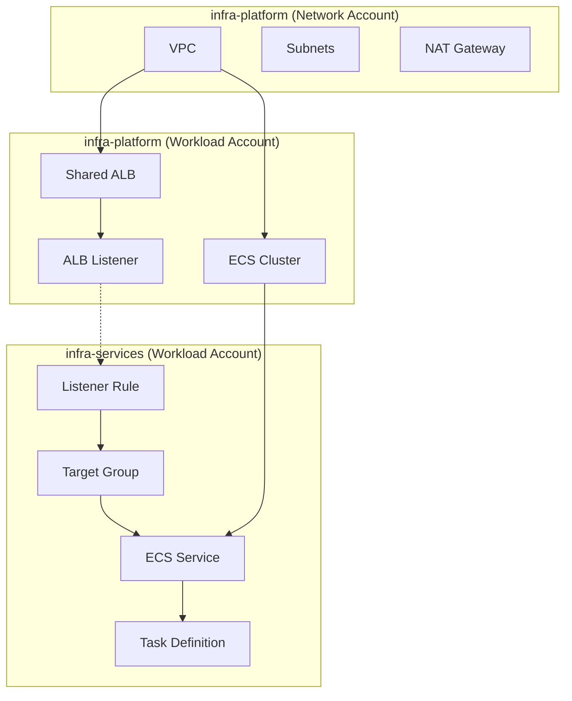

# Appendix: Platform vs. Service Repository Architecture

**Goal:** Provide a clear architectural decision record (ADR) on why we split infrastructure into two repositories and where specific ECS resources reside.

## Core Architectural Decision: The Two-Repo Strategy

We have adopted a **Multi-Repository Strategy** to decouple the lifecycle of the shared platform foundation from the lifecycle of individual application services. This prevents "monolith terraform state" and allows developers to deploy services without risking core network stability.

| Repository           | Purpose                                             | Owner         | Change Frequency    |
| :------------------- | :-------------------------------------------------- | :------------ | :------------------ |
| **`infra-platform`** | Shared Foundation (VPC, ECS Cluster, ALB)           | Platform Team | Low (Weeks/Months)  |
| **`infra-services`** | Application Logic (Service, Task Def, Target Group) | Product Teams | High (Daily/Hourly) |

---

## Resource Placement Guide

### 1. `infra-platform` Repository

This repository manages the "skeletal structure" of the environment. Note that resources here are split across **multiple accounts** (Network vs Workload).

#### A. Network Layer (`00-network`)

- **Account:** Network Account
- **Location:** `environments/network/us-east-1/00-network`
- **Resources:**
  - VPC & Subnets
  - Transit Gateways & VPNs
  - NAT Gateways
  - Internet Gateways

#### B. Compute Layer (`01-compute`)

- **Account:** Workload Account (Dev / Prod)
- **Location:** `environments/dev/us-east-1/01-compute`
- **Resources:**
  - **ECS Cluster:** The empty cluster shell (Fargate provider).
  - **Application Load Balancer (ALB):** The shared entry point for all services.
  - **ALB Listeners (HTTP/HTTPS):** The rules that forward traffic.
  - **Security Groups (ALB & ECS Node):** Base security rules.
  - **Service Discovery Namespaces:** CloudMap namespaces (e.g., `service.internal`).

> **Critical Note:** The `01-compute` layer does **NOT** contain any specific ECS Services or Task Definitions. It strictly provides the "hosting capacity" and "entry door" (ALB).

---

## 2. `infra-services` Repository

This repository contains the actual application deployments. It consumes resources (like Subnet IDs, Cluster Name, ALB Listener ARNs) from the Platform layers via `terraform_remote_state`.

#### Service Application Layer

- **Account:** Workload Account (Dev / Prod)
- **Location:** `environments/dev/us-east-1/<service-name>`
- **Resources:**
  - **ECS Task Definition:** `container_definitions` (CPU, Memory, Image URL).
  - **ECS Service:** The logic maintaining the desired count of tasks.
  - **Target Group:** The resource that health-checks the tasks.
  - **Listener Rule:** The rule connecting the Shared ALB to this specific Target Group (e.g., "Host is api.example.com" -> Forward to "API Target Group").
  - **IAM Roles:** Task Role (S3/DynamoDB access) and Execution Role (ECR pull/Logs).
  - **Security Group Rules:** Allowing ingress from the ALB to this specific service.

---

## Architecture Diagram (Logical)

## Why this Split?

1.  **Blast Radius:** A bad Terraform apply in `infra-services` can only break **one application**. A bad apply in `infra-platform` could down the entire region. We separate them to protect the platform.
2.  **Velocity:** Developers can merge and apply changes to `infra-services` rapidly (CI/CD) without waiting for a platform review.
3.  **Permissions:** Platform repo requires `AdministratorAccess` (often restricted). Services repo can use narrower permissions (e.g., `PowerUserAccess`).
