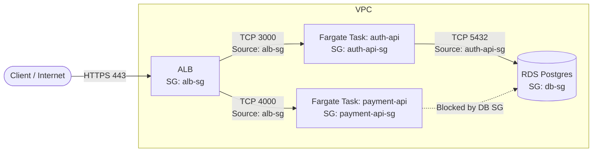

# Appendix: How Security Groups Work in ECS Fargate

When migrating from EC2 to ECS Fargate, one of the most significant architectural shifts is how networking and security groups are applied. Understanding this difference is critical for designing a secure, defense-in-depth architecture.

## The EC2 Model vs. The Fargate Model

### The Legacy EC2 Model (Bridge Networking)

In a traditional EC2-based container setup (or standard EC2 deployments):

- The Security Group is attached to the **EC2 Instance**.
- All containers running on that instance share the same underlying host IP and the same Security Group.
- If you have an `auth-api` container and a `payment-api` container on the same EC2 instance, they share the same network firewall rules.
- This makes granular, least-privilege security difficult. If `payment-api` needs database access, the entire EC2 instance (and thus `auth-api`) gets database access.

### The Fargate Model (`awsvpc` Network Mode)

AWS Fargate exclusively uses the `awsvpc` network mode.

- The **ECS Cluster** is purely a logical grouping of resources. It does not have a VPC, a subnet, or a Security Group of its own.
- Instead, every single **ECS Task** (which contains one or more containers) is provisioned with its own dedicated Elastic Network Interface (ENI).
- Because each Task has its own ENI, **Security Groups are attached directly to the Task**.

## Security Group Chaining Architecture

Security Groups are attached at the Task level and there are no "Cluster-level Security Group" in ECS Fargate. As a result we can implement strict **Security Group Chaining**. This is a defense-in-depth pattern where resources only accept traffic from the specific Security Group of the resource directly in front of them.

### 1. The Application Load Balancer (ALB) Security Group

- **Attached to:** The ALB.
- **Inbound:** Allows traffic from the Internet (`0.0.0.0/0`) on ports 80/443 (or restricted to internal VPN IPs for internal ALBs).
- **Outbound:** Allows traffic to the VPC.

### 2. The Fargate Task Security Group

- **Attached to:** The individual Fargate Task ENI (e.g., `auth-api-task`).
- **Inbound:** Allows traffic **ONLY** from the ALB Security Group ID (e.g., `sg-alb123`) on the specific container port (e.g., `3000`).
  - _Crucial Note:_ Do not use VPC CIDR blocks (like `10.0.0.0/16`) for inbound rules. Using the ALB's Security Group ID ensures that even if an attacker gets inside the VPC, they cannot bypass the ALB to talk directly to the container.
- **Outbound:** Allows traffic to the Internet (`0.0.0.0/0`) for pulling images, talking to external APIs, or specific internal Security Groups (like databases).

### 3. The Database Security Group

- **Attached to:** RDS, ElastiCache, etc.
- **Inbound:** Allows traffic **ONLY** from the specific Fargate Task Security Group IDs that require access (e.g., `sg-auth-api-task`).
- **Outbound:** Standard outbound rules.

## Visualizing the Flow

## Key Takeaways for Platform & Security Engineers

1. **No "Cluster" Security Group:** You do not assign a Security Group to the ECS Cluster. You assign it to the ECS Service/Task Definition during deployment.
2. **Granular Isolation:** You can (and should) create a unique Security Group for every single microservice. This prevents lateral movement. If `auth-api` is compromised, the attacker cannot easily reach `payment-api` or databases that `auth-api` isn't explicitly allowed to talk to.
3. **Zero Trust within the VPC:** By referencing Security Group IDs instead of IP CIDR ranges, you ensure that traffic must flow through your intended architectural paths (e.g., through the ALB where WAF rules and logging are applied).
