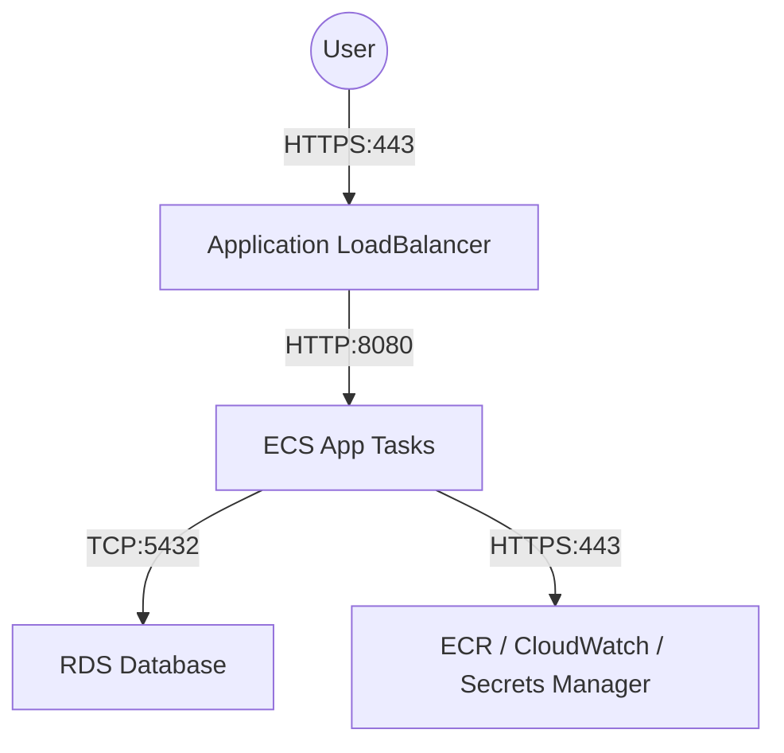

# Security Group Patterns for ECS

## Overview

Security Groups act as virtual firewalls for your ECS tasks and ALB. Proper configuration is critical for security and internal communication.

---

## 1. Application Load Balancer (ALB) Security Group

**Inbound Rules:**

- **Description:** Allow HTTP/HTTPS traffic from valid sources.
- **Protocol:** TCP
- **Port:** 80 (HTTP), 443 (HTTPS)
- **Source:**
  - `0.0.0.0/0` (Public ALB)
  - `10.0.0.0/16` (Private ALB, restricted to VPC CIDR)

**Outbound Rules:**

- **Description:** Allow traffic to ECS tasks.
- **Protocol:** TCP
- **Port:** All (or restricted to app ports)
- **Destination:** ECS Tasks Security Group

---

## 2. ECS Tasks Security Group

**Inbound Rules:**

- **Description:** Allow traffic ONLY from ALB.
- **Protocol:** TCP
- **Port:** Application Port (e.g., 3000, 8080)
- **Source:** ALB Security Group ID (`sg-xxxxxxxx`)
  - _Do NOT use CIDR range `0.0.0.0/0` here!_

**Outbound Rules:**

- **Description:** Allow outbound access to pulling images (ECR), logging (CloudWatch), and external services (RDS, Redis, APIs).
- **Protocol:** TCP
- **Port:** 443 (HTTPS) - Required for AWS API calls (ECR, CloudWatch, Secrets Manager)
- **Destination:** `0.0.0.0/0` (Unless restricted via VPC Endpoints)

---

## 3. Database Security Group (RDS)

**Inbound Rules:**

- **Description:** Allow database connections ONLY from authorized applications.
- **Protocol:** TCP
- **Port:** 5432 (Postgres), 3306 (MySQL)
- **Source:** ECS Tasks Security Group ID (`sg-yyyyyyyy`)
  - _Do NOT use CIDR range! referring to SG ID ensures dynamic scaling works._

**Outbound Rules:**

- None (typically not required for RDS unless it pushes logs or replicates).

---

## Summary Diagram

## Security Best Practices

1. **Least Privilege:** Always restrict specific ports and sources.
2. **References:** Use Security Group IDs as sources, not IP CIDR blocks (except public ALB). This handles auto-scaling automatically.
3. **No SSH:** ECS Fargate tasks do not support SSH via port 22 directly. Use ECS Exec if needed (uses SSM, port 443 outbound).
