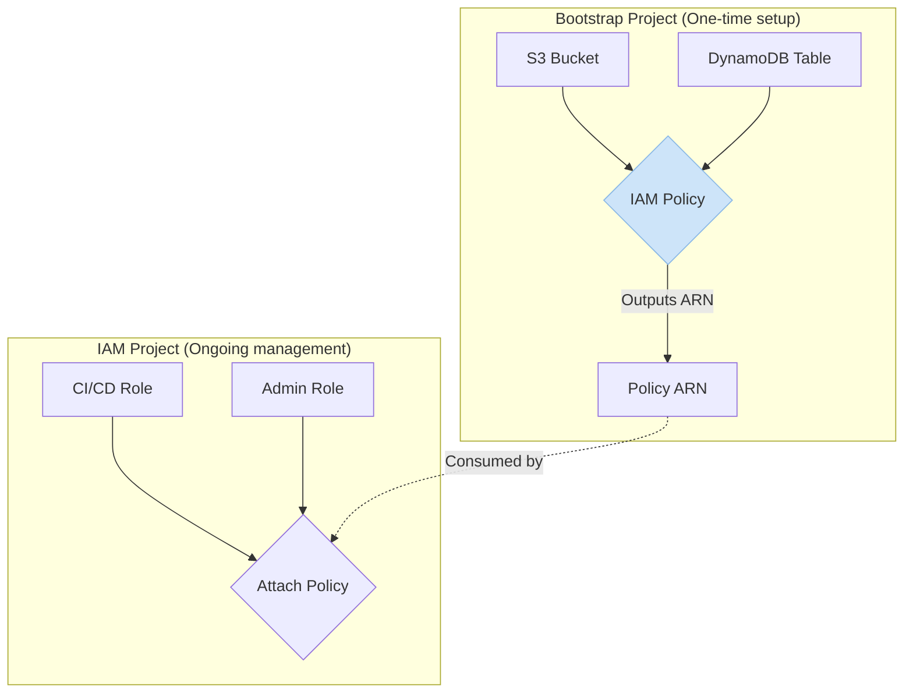

# Appendix: IAM Policy Design Philosophy

Why the IAM policy for state access is created inside the state backend module rather than in a dedicated IAM repository.

## Design Decision

The `terraform-state-backend` module creates its own IAM policy alongside the S3 bucket and DynamoDB table. This is a deliberate design choice based on software engineering principles.

## 1. Self-Contained Modules (Encapsulation)

The module's single purpose is to create a fully functional and secure Terraform state backend. The S3 bucket, the DynamoDB table, and the IAM policy required to access them are all tightly coupled components of this system.

**By keeping them together:**

- ✅ The module is **self-contained** and complete
- ✅ It can be shared or reused without any external dependencies
- ✅ The person using the module doesn't need to hunt down a separate policy from another project
- ✅ Changes to the bucket require corresponding policy updates (co-location makes this easier)

## 2. Avoiding Circular Dependencies

If the policy were moved to a separate IAM-focused repository, it would create a complex circular dependency:

```
IAM Project
    ↓ (needs remote backend to store state)
Bootstrap Project (creates S3 bucket)
    ↓ (needs policy ARN from IAM project)
IAM Project
    ↓ (needs S3 bucket from Bootstrap project)
...infinite loop
```

**The "chicken and egg" problem:**

- Your IAM project would need a remote backend (S3 bucket) to store its state
- That S3 bucket is created by _this_ bootstrap project
- But this bootstrap project would need to fetch the policy ARN from the IAM project to work correctly

This makes both projects difficult to manage and deploy.

## 3. Clear Blast Radius

The IAM policy created here is extremely specific and follows the principle of least privilege.

**It ONLY grants access to:**

- The single S3 bucket created alongside it
- The single DynamoDB table created alongside it

**It does NOT:**

- Manage users, roles, or broad permissions
- Overlap with the responsibilities of a dedicated identity management project
- Grant cross-service permissions

**Example policy scope:**

```json
{
  "Version": "2012-10-17",
  "Statement": [
    {
      "Effect": "Allow",
      "Action": [
        "s3:ListBucket",
        "s3:GetObject",
        "s3:PutObject",
        "s3:DeleteObject"
      ],
      "Resource": [
        "arn:aws:s3:::mycompany-terraform-state-dev",
        "arn:aws:s3:::mycompany-terraform-state-dev/*"
      ]
    },
    {
      "Effect": "Allow",
      "Action": [
        "dynamodb:PutItem",
        "dynamodb:GetItem",
        "dynamodb:DeleteItem",
        "dynamodb:DescribeTable"
      ],
      "Resource": "arn:aws:dynamodb:us-east-1:975050022359:table/terraform-locks-dev"
    }
  ]
}
```

This policy is **tightly scoped** to the resources it was created with—nothing more, nothing less.

## Recommended Workflow

The best practice is to let this module create its own specific policy and output the ARN. Your dedicated IAM project can then consume that ARN and **attach** the policy to the appropriate IAM roles.

**Workflow:**

1.  **Bootstrap Project** creates:
    - S3 bucket
    - DynamoDB table
    - IAM policy (scoped to those resources)
    - Outputs policy ARN

2.  **IAM Project** (separate repository) consumes the ARN:

    ```hcl
    # In your IAM project
    data "terraform_remote_state" "bootstrap" {
      backend = "s3"
      config = {
        bucket = "mycompany-terraform-state-dev"
        key    = "bootstrap/terraform.tfstate"
        region = "us-east-1"
      }
    }

    resource "aws_iam_role_policy_attachment" "ci_cd_state_access" {
      role       = aws_iam_role.github_actions.name
      policy_arn = data.terraform_remote_state.bootstrap.outputs.iam_policy_arn
    }
    ```

3.  **Result:**
    - Bootstrap module remains self-contained
    - IAM project manages role-to-policy attachments
    - No circular dependencies
    - Clear separation of concerns

## Architecture Diagram



## Alternative Approach (Not Recommended)

**Why NOT separate the policy:**

If you tried to manage the policy in a dedicated IAM repository:

```
Attempt 1: Bootstrap creates bucket, IAM repo creates policy
❌ Problem: Bootstrap needs to know policy ARN to output it
❌ Problem: Policy can't reference bucket ARN before bucket exists

Attempt 2: Bootstrap creates bucket + placeholder policy, IAM repo updates it
❌ Problem: Two sources of truth for the same resource
❌ Problem: Terraform import/state conflicts
❌ Problem: Unclear ownership and maintenance responsibility

Attempt 3: Hardcode bucket names in IAM repo policy
❌ Problem: Tight coupling through hardcoded values
❌ Problem: Manual updates required when bootstrap changes
❌ Problem: Easy to create drift between actual and expected resources
```

## Summary

**Keep the IAM policy in the bootstrap module because:**

1. ✅ **Encapsulation** - Module is self-contained and reusable
2. ✅ **No Circular Dependencies** - Avoids chicken-and-egg problems
3. ✅ **Least Privilege** - Policy is narrowly scoped to module resources
4. ✅ **Single Source of Truth** - All state backend resources in one place
5. ✅ **Simplified Maintenance** - Changes to bucket require policy updates (same module)

**Your dedicated IAM project should:**

- Consume the policy ARN via outputs
- Attach the policy to roles (CI/CD, admins, etc.)
- Manage users, groups, and cross-service permissions
- Handle organization-wide IAM governance
